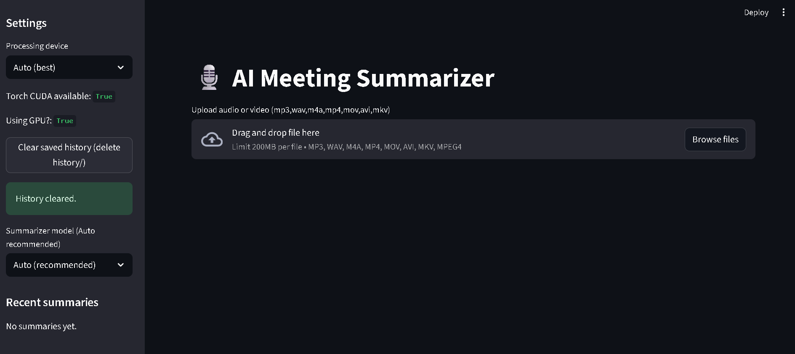

# 🎙️ AI Meeting Summarizer  

> **AI-powered tool** to transcribe and summarize your meetings from audio or video files with precise, structured summaries.  



---

## ✨ Features  
- ✅ Upload **Audio or Video** meeting files (`.mp3`, `.wav`, `.m4a`, `.mp4`)  
- ✅ **Automatic Transcription** with Whisper  
- ✅ **Summarization Models**: Pegasus, Flan-T5, Longformer, or Auto  
- ✅ **Clean UI** built with Streamlit  
- ✅ One-click **Summary Generation**  
- ✅ Stores uploads in `uploads/` folder & can auto-clear history  

---

## 🚀 Tech Stack  
- [Streamlit](https://streamlit.io/) – interactive UI  
- [OpenAI Whisper](https://github.com/openai/whisper) – transcription  
- [Hugging Face Transformers](https://huggingface.co/transformers/) – summarization  
- [MoviePy](https://zulko.github.io/moviepy/) – video/audio processing  
- [PyDub](https://github.com/jiaaro/pydub) – audio handling  

---

## ⚙️ Installation  

```bash
# Clone the repository
git clone https://github.com/your-username/ai-meeting-summarizer.git
cd ai-meeting-summarizer

# Create virtual environment
python -m venv venv
venv\Scripts\activate    # On Windows
source venv/bin/activate # On Mac/Linux

# Install dependencies
pip install -r requirements.txt
Make sure FFmpeg is installed and added to PATH (needed by moviepy and pydub).

Download FFmpeg or install via Chocolatey on Windows.

▶️ Usage
bash
Copy
Edit
# Run the Streamlit app
streamlit run app.py
Upload your meeting audio/video file

Wait for transcription

Click Generate Summary

Get a concise summary of your meeting 🚀


🛠️ Future Improvements
Add speaker diarization (who spoke when)

Support for real-time meeting transcription

Export summary as PDF/Word

Cloud storage for transcripts

🤝 Contributing
Pull requests are welcome! For major changes, please open an issue first to discuss what you’d like to change.

